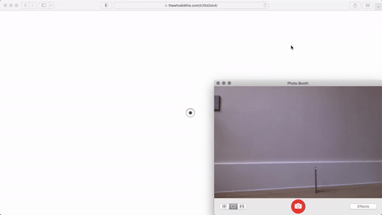

Hi from South London, thanks for checking out my codes. I have a music background and mostly understand web, audio, and graphics programing. I am into Unix, vanilla JS, GLSL, Swift, and Go.

[**JS modules &rarr;**](https://thewhodidthis.com/modules/)  
_The bulk of which are below 1k thanks very much._

[**Ivory &rarr;**](https://thewhodidthis.net)  
_Web based artefacts of culture set in the ivory template arranged
across the binary palindromic series_ [`A006995`](https://oeis.org/search?q=A006995).

[**Sketches &rarr;**](https://thewhodidthis.com/sketches/)  
_Creative coding experiments made studying larger problems._

[**Tabs &rarr;**](https://thewhodidthis.com/tabs/)  
_The idea being to come up with different ways of animating by page refresh only._

[**Links &rarr;**](https://thewhodidthis.com/links/)  
_Things I like and think worth bookmarking._
